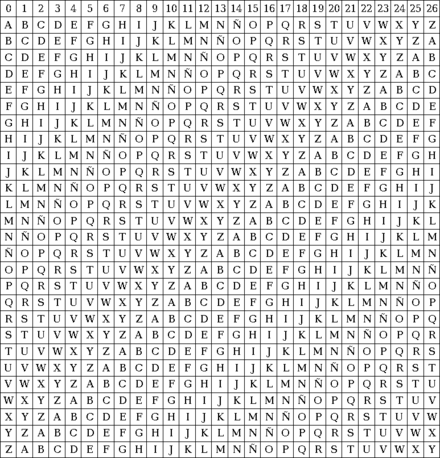

<h1>./issk.sh 2>/dev/null &;disown</h1>
## Apuntes: Tipos de cifrados

Los dos tipos principales de cifrado son el cifrado simétrico y el cifrado asimétrico. 
- `Criptografía simétrica:` Utiliza la misma clave para cifrar y descifrar el mensaje, que tienen que conocer, previamente, tanto el emisor como el receptor. 
- `Criptografía asimétrica:` Se basa en el uso de dos claves.

### AES-256-CBC 

Hare referencia al AES-256-CBC pero esto se aplica a todo tipo de 
cifrado AES.

Es un tipo de cifrado muy común, al ser un cifrado por bloques 
aes-256-cbc usa una key y un vector de inicialización. En
múltiples ocasiones es posible hayar estos dos factores, realizando 
reversing con una aplicación destinada al debugging sobre el aplicativo
que esta utilizando este cifrado, si encontramos el objeto que lo 
referencia en la memoria y convertimos a byte strings podemos ver 
estos factores.

Desde ghidra podemos encontrar estos factores:

Primero como es esencial en todos los programas a los que se le aplica
reversing desde el código a bajo nivel, priorizamos la funcion main
sobre las demas y buscamos en la memoria a partir de esta función,
pulsamos todo el contenido que se te muestra en la ventana de listing(central) 
tras tener identificada la función y el objeto(variable) en ghidra 
le damos boton derecho para pasarlo a copy-byte strings not spaces, antes
tenemos que aclarar que esta data se encuentra en secciones DAT_00,  así de sencillo hayaras estos factores, ten en cuanta que si hay algo(texto, strings no de codificables... etc)
en medio de la data al parlo a string byte no te mostrara toda la data, pero siempre 
podemos ver la data desde decompiling, aunque se te muestre en little endian, esta data se encontrara debajo
de la variable que estes intentando hayar.

Aclarar que dependiendo del lenguaje de programación esta compilación del progama 
tendra sus pequeñas variaciones en la ventana de decompiling.

Actualmente, hay tres tipos de cifrado AES: 128 bits, 192 bits y 256 bits, donde este último por su longitud en el número de bits es el más seguro. Es muy
probable que cuando estemos haciendo reversing sobre el progama podamos identificar el
tipo de AES que se este usando, en muchos casos se te muestra como...
::ctr

tipos :cbc, ctr, cfb etc...

[Variables del cifrado](https://laseguridad.online/questions/4293/cuales-son-las-variables-de-aes)


## Cifrado Cesar y variante ROT13

Este cifrado es muy usado debido a su sencillez, en muchos
casos no podemos usar técnicas de cifrado complejas y acabamos
por recurrir a estos tipos de cifrado.

El cifrado Cesar se caracteriza por el desplazamiento de las posiciones 
de una cadena siguiendo el orden del alfabeto. Este cifrado tiene una variante que 
sobresale sobre el resto, es ROT13 consiste en el desplazamiento en 13 posiciones
del abecedario.

 

Existe un cifrado más avanzado, este es el vigenere.

## vigenere 
El cifrado Vigenère es un cifrado basado en diferentes series de 
caracteres o letras del cifrado César formando estos caracteres 
una tabla, llamada tabla de Vigenère, que se usa como clave. El 
cifrado de Vigenère es un cifrado polialfabético y de sustitución. 
El cifrado Vigenère se ha reinventado muchas veces.

Página para descifrar:
https://cryptii.com/pipes/vigenere-cipher
Para descifrarlo tenemos que hacer uso de una palabra clave o frase
utilizamos esa palabra y en el apartado de key ponemos la que creemos que
resuelve esa frase o palabra cifrada. Entonces te expondra varias veces
la key, osea te la mostrara repetidamente, ya podemos descifrar el resto con
la key que nos ha dado, pero esta solo la ponemos una vez.

Tabla vigenere:



Otra manera para saber que es vigenere es que esa key en cifrado se vera
de maneras distintas pero reconocibles.

Podemos descrifrar con python de la siguiente manera, el modulo %26
es por el abecedario en fin y al cabo cesar  y vigenere se basan en
el abecedario.

```python
#!/usr/bin/python3

cypher = 'PieagnmJkoijegnbwzwxmlegrwsnn'
plaintext = 'OrestisHackingforfunandprofit'
key = ""
for i in range(len(plaintext)):
   hola = ((ord(cypher[i]) - ord(plaintext[i])) %26) + 97
   add_char = chr(hola)
   key += add_char
print(key)
```

## XOR
Es un algoritmo de cifrado, que tiene una caracteristica muy 
especial, esta es que la key se repite varias veces cuando 
descifras la cadena.

Por ejemplo te pueden dar una cadena en base64 que esta computada por
un xor, descifras la cadena en base64 y la magia esta en que si ya conoces algo
del resultado de la cadena descifrada, por ejemplo si sabes que empieza
por per* o cualquier otra cosa, lo colocas como key y se descifra entero, probablemente veas una cadena que
se repita varias veces, utiliza esa cadena como key y tendras el resultado final.

En cyberChef se puede jugar con esto. 
Tambien desde aqui se puede aplicar fuerza bruta.

#### Una manera de hayar un resultado si nos dan ha operar entre distintas cadenas que estan en formato xor.

```python
import os

def bxor(ba1, ba2):
    return bytes([_a ^ _b for _a, _b in zip(ba1, ba2)])

ct1 = bxor(key1, flag)
ct2 = bxor(ct1, key2)
ct3 = bxor(key2, flag)

ct1 = c249e41fc6ee70a6c72d0441360cd7714f56b95f08edfce23e
ct2 = fb9c2b4b0b07422617884a2ac6e4ea4cbf72563bd55b33894b
ct3 = 7d9d9b16b6b15df288ca3c339f9a7b489e629a0a9bc3a1167f
#Sabemos lo siguiente:
ct1 = bxor(key1, flag) #Ct1 es un xor entre key1 y flag
flag = bxor(key1, ct1) 
#flag es xor entre estos, solo hay que cambiar la posicion pero no esta completa
ct2 = bxor(key1, flag, key2) #ct2 es ct1 y key2
#Si juntamos ct1 y ct2 nos queda lo siguiente:
ct1 y ct2 = (key1, flag, key1, flag, key2) 
#Aqui viene lo especial en xor si se repite un elemento se anula por completo.
#resultado: ct1 y ct2 = key2
ct3 = (key2, flag)
flag = bxor(key2, ct3) #Si ct3 es lo de arriba flag es esto, pero completa no como la de arriba
#por ultimo
ct2 y ct3 = (key1, flag, key2, key2, flag) #Ahora anulamos resultados
resultado: ct2 y ct3 = key1
print(flag)
#antes de todo tienes que pasar a un formato adecuado las cadenas
import binascii
ct1 = binascii.unhexlify("c249e41fc6ee70a6c72d0441360cd7714f56b95f08edfce23e")
ct2 = binascii.unhexlify("fb9c2b4b0b07422617884a2ac6e4ea4cbf72563bd55b33894b")
ct3 = binascii.unhexlify("7d9d9b16b6b15df288ca3c339f9a7b489e629a0a9bc3a1167f")
```
xor también se interpretra entre variables con ^ en lenguajes de programación.

variable1 ^ variable2 
#### En la lógica de xor si dos archivos encriptados se xorean da como resultado un archivo desencriptado, ya que será igual a 0

### RSA 

La criptografía RSA es un cifrado asimétrico que se utiliza en muchos ámbitos de la transmisión de datos en Internet por su facilidad de uso. Este sistema consta de una clave RSA pública y otra privada. La clave pública se utiliza para el cifrado y la privada para el descifrado. Como no hay ningún algoritmo que pueda determinar la clave privada a partir de la clave pública, el procedimiento se considera seguro. Además del cifrado, el sistema de la criptografía RSA también sirve para generarfirmas digitales.


